**关于在Aimer战雷盒子中遇到有关WT自定义常见问题解答**

V1.01 bate

大家好，这里是哈气·发来，由于许多新进想使用战雷盒子的雷批不懂如何去使用此战雷盒子，所以今天我将在这里用书面的形式来为大家讲解。

**1.语音包**

**2.自定义皮肤**

**3.自定义瞄具**

**4.自定义文字**

**5.安装与启动**

**6.车库问题**

1. **关于使用最多的模块，战雷自定义语音包。**

1. **无法加载7.zip模式**

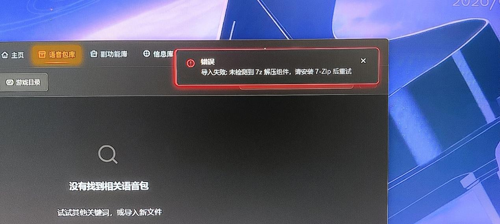

答：如此情况，此为老版本的BUG，请移步任意QQ群中的群文件进行下载，或者进入GitHub的此网页进行下载最新款

[GitHub - AimerSo/AimerWT at v3.0.1 · GitHub](https://github.com/AimerSo/AimerWT/tree/v3.0.1)

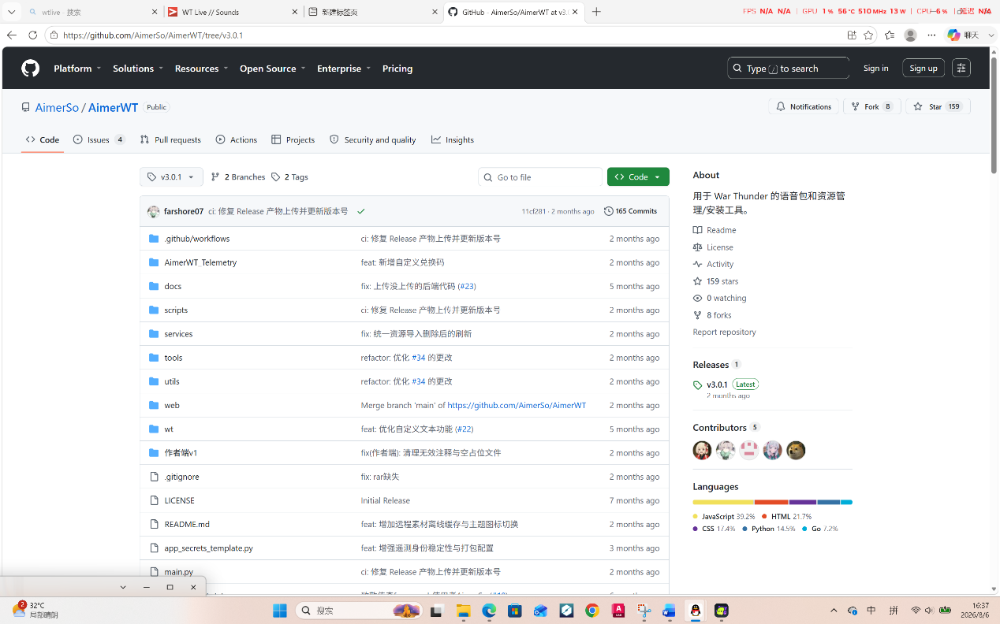

**1.2是否要解压文件才能使用语音包**

答：不需要，因为管理器内有自动帮助玩家进行解压的插件，只需要你将你想要的压缩文件拖动到管理器的语音包管理处即可，

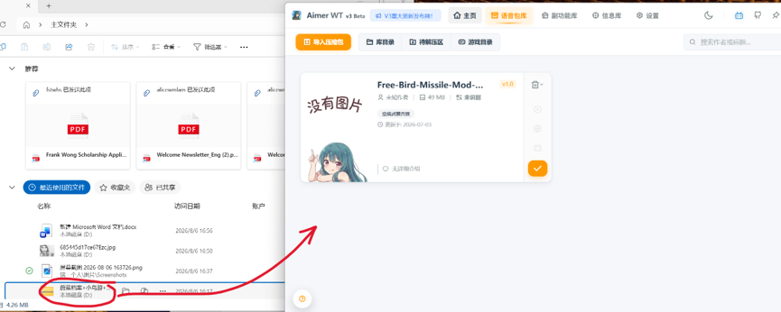

**1.3为什么我将我的下载的语音包下载好了，没有在管理器上加载出来**

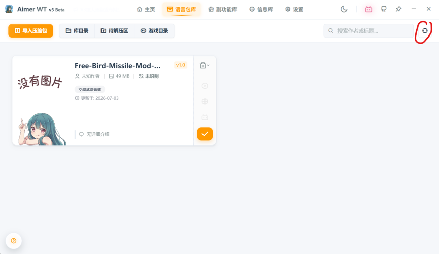

答：由于管理器没有强制刷新，且强制刷新可能影响你们的游戏体验（许多玩家在玩游戏的时候不会将这个管理器关闭），需要你们手动点击刷新键来进行刷新，点击我红标处。（1.01补丁，3.01版本已经修好，但防止老板本，此处保留）

**1.4为什么文件夹中有某种的语音包，而软件识别中没有。**

答：此问题为语音包作者问题，本管理器在安装语音包的     时候就已经识别出语音包中所能用的语音文件，如果发现不能用的管理器就不会给你进行安装。如还有疑问，请咨询此语音包作者。

**1.5是否还需要我们去手动更改游戏的SOUND的记事本代码。**

答：不需要，管理器发明的初衷就是为了帮助大家更好的去使用战雷的自定义，这个功能早在V2.bate时期就已经完成自动化更改，无需自己手动继续更改。

**1.6（老问题，防止没解决）为什么我装语音包之后我的游戏一卡一卡的**

答:由于BVVD这个老牧师的不发新的语音包文件，加上战雷本身就是史山代码，导致游戏中的自定义语音包出现卡死，可以到我们的QQ群的文件夹中找到降噪包进行替换。

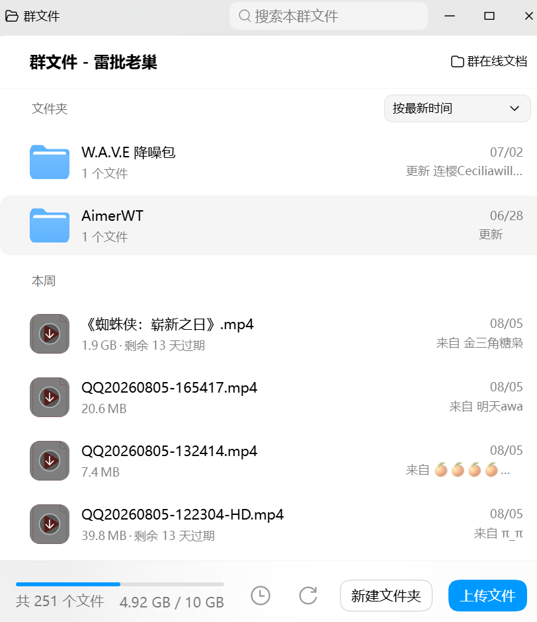

**1.7为啥我安装语音包的时候会一直弹游戏路径有问题**

答：因为我们的管理器忘记做自动补sound块了，导致我们的管理器无法识别到语音包已经成功拖入。所以，请下载群里已打补丁的版本821版。

**1.8为啥我输入解压密码的时候出现网页跳不出来的问题。**

答：这属于一个BUG，开发者说已经修好，但存疑。如果出现无法跳转的界面，请大退管理器，然后在管理器外侧将文件解压完毕。之后再拖进文件夹中

**2.自定义皮肤**这个最简单，基本没什么好讲的。

**2.1我导入了，为什么游戏里面没有**

答：你需要在游戏中的外观定制中找到自定涂装，点进去就能找到你导入的皮肤

**2.2为啥我无法导入**

答：开发者说已经成功完成自动建库，此为真。但是考虑到有许多人用的是旧版本，导致无法自动建库，所以需要老版本的用户到游戏的自定义外观中进行手动建库，就在自定义涂装旁边有一根仙女棒，点一下就自己建库了。

**3.自定义瞄具**

**3.1为什么我在游戏里面搜索设置，没有选项**

答：这个东西无法在更改按键的地方进行更改，这个东西只在游戏选项中进行更改。

**3.2为什么我在更改界面没有瞄具选项**

答：因为要在这里进行选择

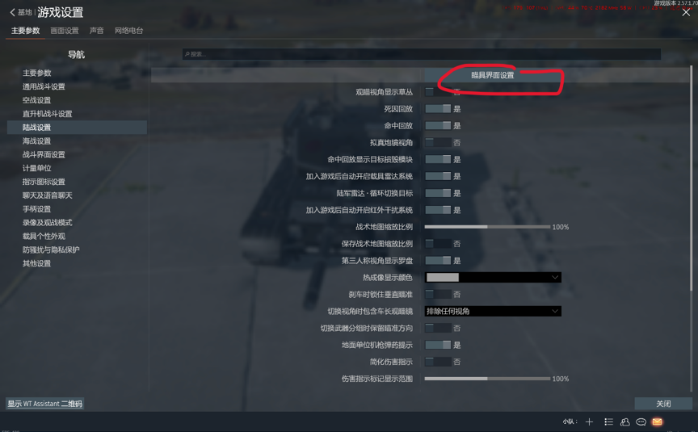

然后再这里进行选择

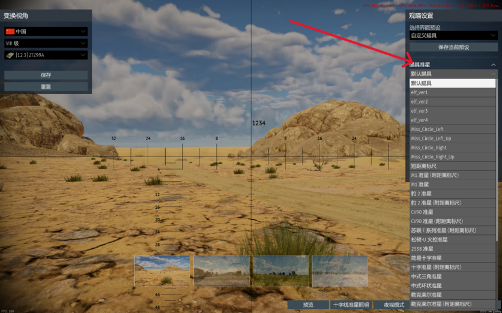

**3.3为啥我都加入了，为啥我找不到自定义炮镜呢**

答：请检查你自己的UID是否是你现在所使用的账号的

3.3补充，如何了解你现在玩的UID是哪个，先进入游戏，然后退 出，之后进入进入此电脑，根据我图片上面的导引一步一步的找到这个文件夹里面。

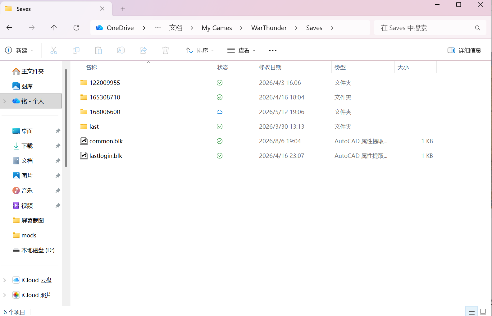

然后点击这里，这里面的UID就是你现在在玩的UID。之后就到管理器的这里进行查找

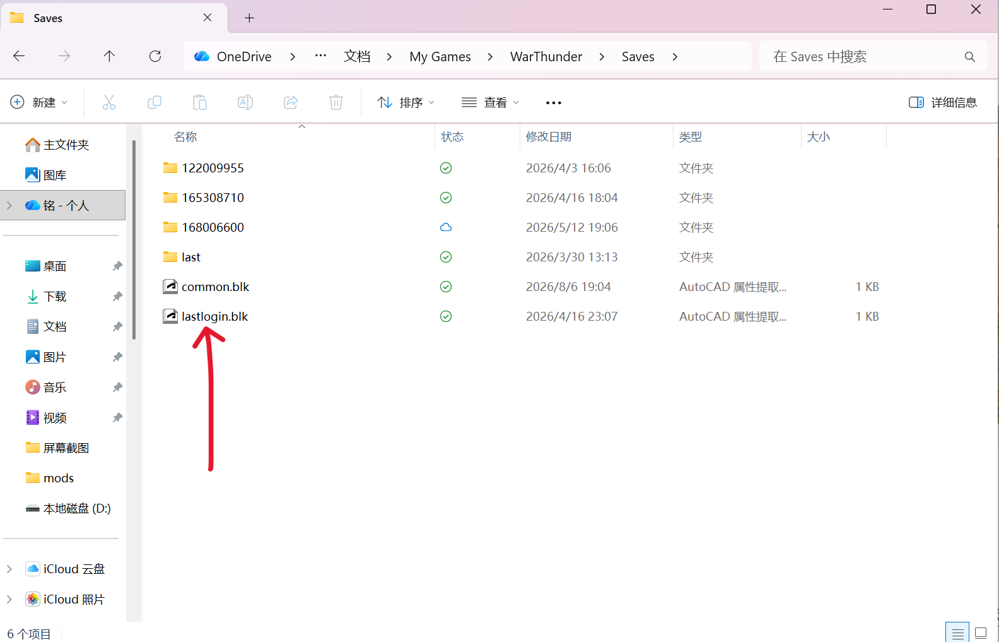

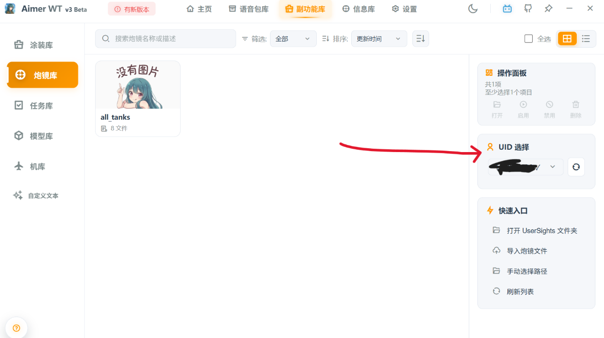

**3.4为啥我的炮镜导入不了**

答：可能是你没有在文件夹中创建一个文件夹，名为 all\_tanks 因为只有这个才能被战雷的客户端识别为你的炮镜资料。

**3.5 为啥我导入炮镜的时候会出现这种问题**

（由QQ用户@这个滨滨就是逊了 发现）

1. 答：因为这属于管理器的一个小BUG，现在已经修复，请下载群文件中的821版本。开发者Aimer已经发布补丁版本，现已可以正常使用

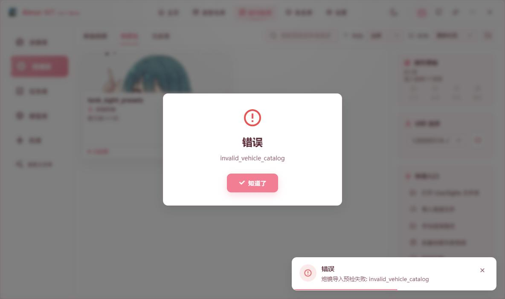

**3.6为啥我用大松松的炮镜资料会显示导入失败**

（由@lucifer发现）

答：因为大松松的炮镜中有很多的重名文件，使得管理器为了保证用户体验而采取的保护措施，其保护措施如下，一无法让管理自行更改瞄准镜名字，如有需要，请自行更改。（当然这其实也是一个BUG，现在也正在修复）

**4.自定义文字**

这个其实没有什么要讲的，将大家最想改的地方标出来

Exp\_reasons 这个是改局内命中，包括命中，致命伤害，重创目标等，如果有需要更改，请自行探索，我方不在做其他解释。

**5.安装与启动**

**5.1我是电脑小白，我不知道怎么下载有关的管理器**

答：需要考虑你电脑的系统，大部分人的系统WINDOWS，所以只需要下载群文件中的文件即可，这可以大大的节约你们的时间，当然如果是linux系统的话，建议你直接去GitHub上找到Aimerso的主页，下载最新的AimerWT最新管理器。

**5.2为啥我下载了正确的版本，我用不来了**

答：有可能是因为你的电脑的系统过老，如Win7或Win8，这些系统不支持PY10，而我们的这个管理器的基础就是搭在PY10上的，同时我们不可能费劲去向下兼容，一是没有必要，二是现在的软件已经逐步淘汰掉WIN7系统，后面战雷也可能淘汰WIN7系统，所以如果遇到安装失败的弹窗，请升级你的系统

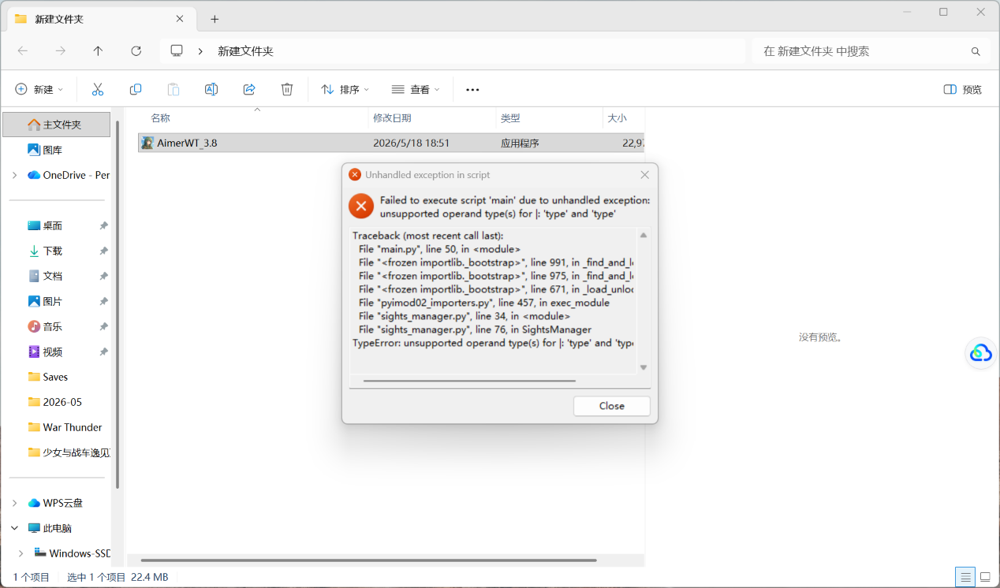

**5.3我已经检查完我的系统了但是为啥弹出这个东西**

答：因为你的C盘空间不足，需要你将C盘中的资料迁移到其他盘，不然我们的缓存存不下来，如果想保险起见，请为你的C盘至少留出5G的空间来确保你能够直接打开

**5.4为啥我得不到我的UID。**

答：因为我们的服务器短时间之内接收到大量的请求，导致服务器压力过大。使得部分使用者出现无法进入的问题。这个我们表示歉意，如果想查到UID请大退管理器，强制让管理器刷新，这样应该就可以连接进入。

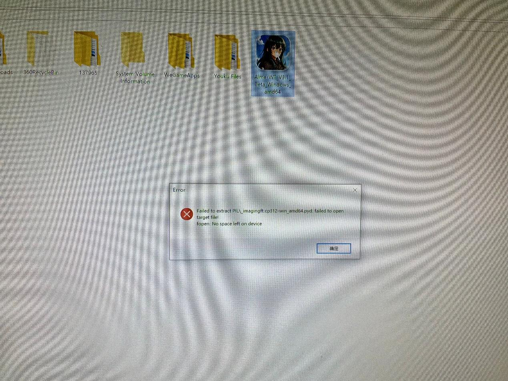

**5.5为啥我打开我的管理器会跳出白屏**

（由QQ用户@酷爱 和@GTD1250T 先后发现）

答：这属于小插件的消失，现在的解决办法是先用电脑的CMD运行以下指令winget install Microsoft.EdgeWebView2Runtime让电脑自动安装插件，再尝试打开管理器；二，如果无法实现，请直接卸载管理器，重新下载，让电脑强兼。

**5.6为啥我开启了自启动为啥我进去就是白屏了呢**

（由@AAAPro发现）

答：这个和上面的那个小插件消失是一样的，因为开机的时候管理器比小插件更早的运行，使得管理器白屏，现在并没有完全根治的办法，要么就是关闭自启动，要么就是自启动之后手动退出管理器重新进入。

**6.车库问题**

**6.1为什么打不开,**

答:因为某些原因,使得我们的车库资源库暂时无法正常使用,所以需要使用者上网找到对应的教程来进行替换.

任务库，车库，以及模型修改现阶段还没有问题，资料缺失。

注意！！！加机库可能导致游戏对Config.blk重置，可能导致你之前装的语音包和自定义文字失效，请慎重考虑之后再安装